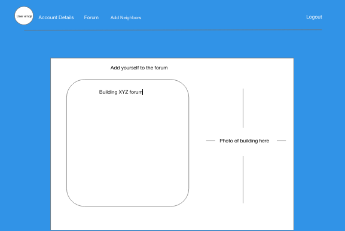
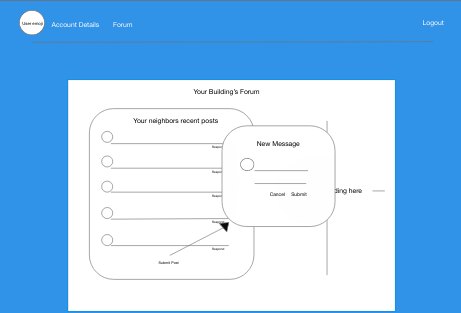
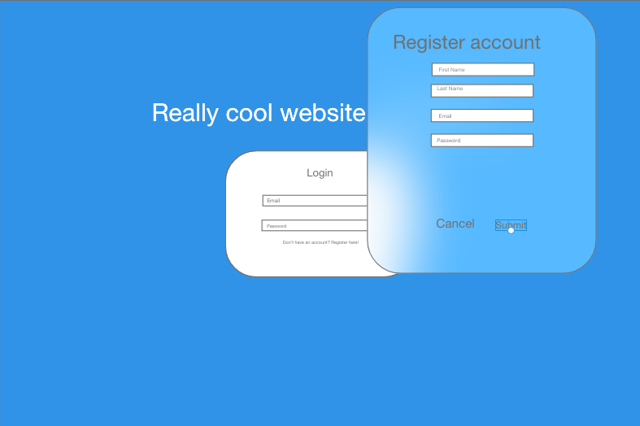
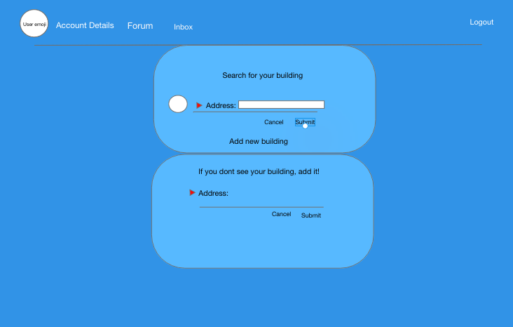

### Link
https://ant-farm.github.io/capstone-react/

### What is this app?
Friendly is an application that allows neighbors living in the same building to interact through a forum of posts.

### Technologies used:
MongoDB 
Express 
NodeJS
React
Mongoose
Javascript
HTML
CSS
Semantic-UI

### Installation Steps
Clone the react as well as the express applications on your local computer
After you clone npm install 

### User Stories
Welcome to X. This site focuses on the internal communication that happens between condo associations.
The user will come to the site to register their information as well as provide their building's address. Once registration is complete they will then be directed to that building's unique forum where they can submit posts to their neighbors. The forum will be used to allow neighbors to keep in contact, alert one another in case there is a security issue, post party / association meetings as well as day-to-day items and questions via message boards.

### Wireframes

